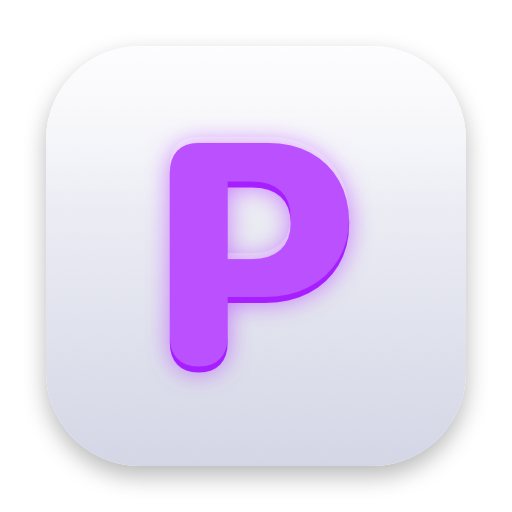

<!-- LOGO -->
<h1>
<p align="center">
  
  <br>Pintty
</h1>
  <p align="center">
    A spatial canvas workspace for your terminal.
    <br />
    A fork of <a href="https://github.com/ghostty-org/ghostty">Ghostty</a> that turns terminal panes into movable glass windows on an infinite canvas.
    <br />
    <a href="#about">About</a>
    ·
    <a href="#features">Features</a>
    ·
    <a href="#keybinds">Keybinds</a>
    ·
    <a href="#configuration">Configuration</a>
    ·
    <a href="#building">Building</a>
    ·
    <a href="#built-on-ghostty">Credits</a>
  </p>
</p>

## About

Pintty is a terminal emulator built on [Ghostty](https://github.com/ghostty-org/ghostty),
inheriting its fast, native, GPU-accelerated core. On top of that foundation Pintty adds
a **canvas mode**: instead of rigid tabs and tiles, your terminals become free-floating,
resizable, frosted-glass panels on an infinite pannable and zoomable surface — terminals
as objects on a desk rather than cells in a grid.

Everything Ghostty does, Pintty still does. The canvas is an additive layer you can toggle
on and off; with it hidden, Pintty behaves like a stock Ghostty window.

## Features

- **Canvas mode** — terminals become free-floating panels on an infinite canvas.
- **Frosted-glass panels** — translucent windows with a configurable accent and blur.
- **Pan & zoom** — glide across the canvas and scale it to fit your whole workspace.
- **Spawn & close in place** — drop a new terminal anywhere; hover a panel to reveal its close control.
- **Per-window text zoom** — scale the shell text inside the focused panel independently.
- **On-canvas cheat-sheet** — a keybind reference card a keystroke away.
- **Built on Ghostty** — standards-compliant emulation, Kitty graphics, ligatures, and native macOS integration come along for free.

## Keybinds

| Key | Action |
|-----|--------|
| `⌘ T` | Spawn a new panel under the pointer |
| `⌘ W` | Close the panel under the pointer |
| `⌘ -` / `⌘ +` / `⌘ 0` | Zoom shell text out / in / reset |
| `⌘ ⇧ P` | Toggle canvas mode |
| `⌘-drag` | Pan the canvas |
| `⌃-drag` | Move a panel |
| drag corner | Resize a panel |
| `⌘ /` · `esc` | Toggle / dismiss the cheat-sheet |

> Symbol shortcuts match the typed character, so they work across keyboard layouts.

## Configuration

Canvas behavior is read from `~/.config/pintty/config.json`:

```json
{
  "canvas": true,
  "glassOpacity": 0.18,
  "accent": "#6B8FBC"
}
```

All standard Ghostty configuration (`~/.config/ghostty/config`) continues to apply.

## Building

Pintty builds with the same toolchain as Ghostty. With Zig 0.15 installed (macOS):

```sh
zig build -Doptimize=ReleaseFast
codesign --force --deep --sign - zig-out/Pintty.app
open zig-out/Pintty.app
```

Build prerequisites and project layout follow upstream
[Ghostty](https://github.com/ghostty-org/ghostty).

## Built on Ghostty

Pintty is a derivative work of [Ghostty](https://github.com/ghostty-org/ghostty) by
Mitchell Hashimoto and the Ghostty contributors. All upstream copyright is retained, and
the entire fast, native terminal core is their work — Pintty only adds the canvas layer on
top. Pintty is not affiliated with or endorsed by the Ghostty project.

If you want a world-class terminal without the canvas, use Ghostty directly.

## License

Pintty is released under the [MIT License](LICENSE), the same license as Ghostty.
